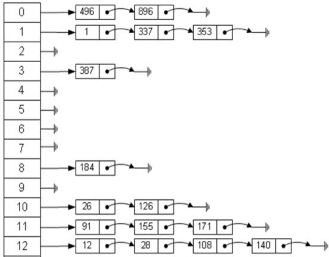
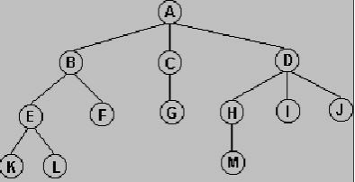
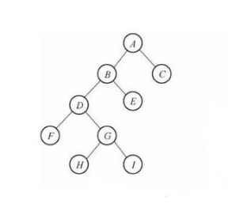
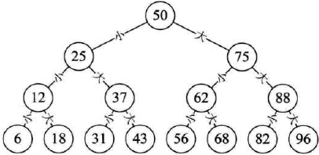
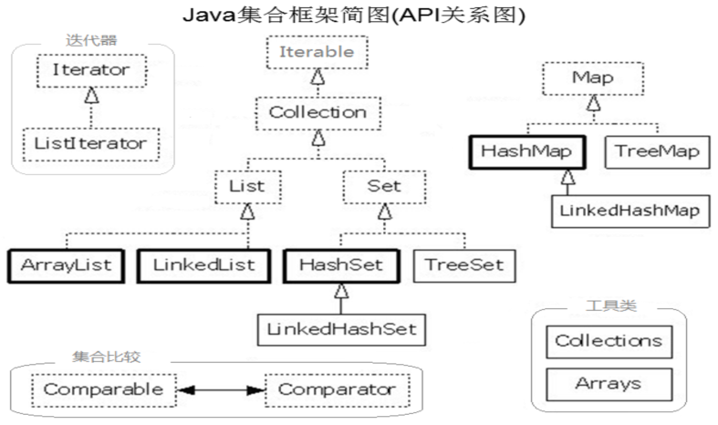
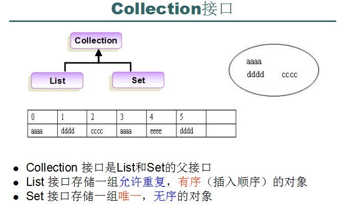

### 一、数据结构
1.研究和解决什么问题？
一堆数据怎么在内存中存储更方便、更高效

2.数据在内存中不一定都是挨着连续存储的

3.例如公司，党派，帮派；每个都有自己的组织模式和运行机构来帮助他们正常发展和运行。

4.常见的数据结构：
线性表(list)   链表(linked list)    栈(stack)    队列(queue)  树(tree)

5.list，线性表  分三种

|名称|介绍|举例|
|---|---|---|
|有序列表 |插入的顺序作为遍历的顺序，位置不变(长度固定)| 数组
|顺序存储 |插入的顺序作为遍历的顺序，允许插入和删除（位置可变）   长度可变   缺点：插入和删除的效率低    优点：查询效率高||
|链式存储(链表) |哪里有空位，就可以往哪里存  优点：插入和删除的效率高  缺点：查询效率很低||

6.栈   先进后出，后进先出，就像弹夹    限制了插入和删除的位置，只能在一端(尾部)进行
例如：
浏览器的“前进”和“后退”
很多软件的“撤销”和“恢复”

7.队列(queue)   先进先出  后进后出     插入是在对尾，删除是在对前      客服电话的排队
例如：大学食堂排队打饭，医院挂号排队等

8.Hash table(散列表，也叫哈希表)是根据关键码值(Key-value)而直接进行访问的数据结构。也就是说，它通过把关键码值映射到表中一个位置来访问记录，以加快查找的速度。（目录+链表，就像字典）

- 特点：目录+链表   插入、删除和查询的效率都很高
- 缺点：没下标
- 

9.树        二叉树      平衡二叉树(红黑树)   特点    插入、删除和查询的效率都很高

### 二、Java集合概述

1.我们要存的数据的个数是不确定         集合

2.数组只能存同一种类型的数据

3.集合可以称之为超级数组

4.打开java.util.ArrayList的源代码，首先映入眼帘的是@author  Josh Bloch，
这位大叔就是玉树凌风，风流倜傥，人称Java之母的Josh Bloch ，Java集合框架就是他一手打造的

5.结构图

三、List接口

1.Collection接口是List和Set接口的父类

2.List 接口存储一组允许重复，有序（插入顺序）的对象，有下标，插入顺序作为遍历的顺序

3.Set 接口存储一组唯一，无序的对象    没下标     插入的顺序跟遍历的顺序是不一样的

4.List接口中的功能方法
List 接口存储一组允许重复，有序（插入顺序）的对象(包括null)，可以通过索引（下标）来进行访问

| 作用  |  方法名 |
| ------------ | ------------ |
|  存储（添加）  |   |
|  | boolean add(Object o)   继承自Collection  |
|   |  void add (int index，Object o)     加塞儿专用 |
|  替换 |  |
|   | set(int index，Object o)  |
|  删除 |  |
|   | remove(Object o)  继承自Collection |
|   | remove(int index) |
|   |void clear()  继承自Collection |
| 判断  |   |
|   | boolean contains(Object o) 继承自Collection，内部调用indexof实现 |
|   |  boolean isEmpty()   继承自Collection |
|   |  int indexOf(Object o) |
|   |  int lastIndexOf(Object o) |
| 获取  |   |
|   | int size()   继承自Collection  |
|   | Object get(int index)    |
|   | Object[] toArray()    继承自Collection  |

四：List接口的三个常用实现类

|  类名 |  底层数据结构 |  线程是否安全 | 效率  | 增量值  |
| :------------: | :------------: | :------------: | :------------ | :------------ |
| Vector  |  动态的数组结构 | 线程安全 | 无论增删还是查询都非常慢  | 默认初始容量为10，增量为10  |
| ArrayList  | 动态的数组结构  | 线程不安全  | 增删的效率很慢(因为要移动数据)，但是随机查询的效率很高。 | 默认初始容量为10，增量未指定（经调试发现：原容量的50%）  |
| LinkedList  | 链表数据结构  | 线程不安全  | ，对元素的增删的操作效率很高，随机查询的效率低(因为要移动指针寻址)  |  默认初始容量为0，增量不明确 |

七、泛型   泛型即（Generic type），是Java 5新加入的特性
1. 集合是可以存任意类型的数据，表面上看功能非常强大
2. 存的时候很方便，取的时候困难重重    从集合中取数据时不知道该转换为什么类型，这叫类型安全问题
3. 解决办法就是：让集合可以存任意类型的数据，但是只能存同一种
4. 这就叫泛型
5. 一个集合一旦指定了泛型，那么该集合就只能存同一种类型的数据，那么取数据的时候，就不用强转了
6. 泛型只支持引用数据类型，基本数据类型要使用它的包装类
7. JDK7以后新增了一个菱形写法
8. 泛型的实现原理：	让数据类型参数化
9. Java中实现的泛型是伪泛型 ，就是JVM是不支持泛型的,只是在编译的时候检查一下类型是否一致，编译通过会把
字节码中的泛型代码全部删掉(类型擦除)

