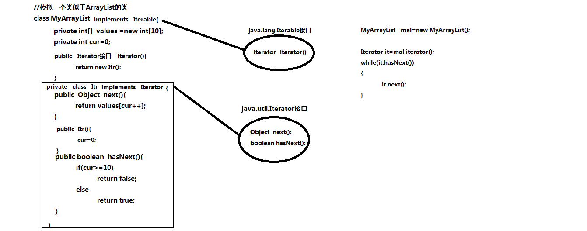

#### 一、Set接口

1.父接口   Collection

2.特点     唯一    无序（插入顺序跟遍历顺序不一致，没下标）

唯一：Set集合中不允许出现重复的元素，如果向Set集合中存储重复的元素是无效的，但不会报错

无序：Set集合不会维护集合中元素的插入顺序，即不存在下标或索引

3.Set接口中的功能方法 （Set接口中没有自有方法，全部继承自Collection接口）

4.凡是带有下标的方法都不支持

#### 二、HashSet

1.数据结构(散列表)   线程不安全     HashSet采用哈希(散列)数据结构来存储对象，大大提高查询效率

2.构造方法

3.通过代码证明Set集合都是唯一       无序

4.添加重复数据时不会报错，而是无效

5.当使用该集合存储自定义类型的数据时，**要求必须重写hashCode和equals方法**

在添加新数据的时候，先判断hashCode，不相等就添加；如果相等则判断equals，不相等就添加

#### 三、LinkedHashSet

1.它跟HashSet一样，也是无序、唯一的，不保证线程安全

2.功能性方法也都一样

3.维护插入顺序作为遍历顺序(仍然没有索引或下标)

多了一个链表用来维护插入顺序作为遍历顺序(仍然没有索引或下标)


#### 四、TreeSet类

1.数据结构（平衡二叉树）   线程不安全        效率 优缺点

2.构造方法

**3.它也是保证唯一性，同时可以对数据进行“自然排序”，仍然没有下标**

4.它有几个特有的方法，其他方法跟HashSet一样

```
public Object ceiling(Object e)
public Object floor(Object e)
public Object first()
public Object last()
public Object higher(Object e)
public Object lower(Object e)
```


#### 五、遍历方法for和foreach

1.for循环   一般控制下标   只适合有下标的数组或集合,比如set没有下标，就无法使用for循环遍历

2.对于没有下标的集合(如set)，需要用foreach循环，foreach可用于数组，可用于List，也可以用于Set

3.foreach其实是借助于迭代器实现遍历的，Java编译器在编译代码的过程中，会把foreach代码转化为迭代器代码（可以查看字节码文件）。

#### 六、迭代器写法

1.把集合中的数据当成一个一个景点

2.逛所有的景点就是遍历
 
3.需要一个导游(迭代器)    Iterator<跟集合一致> it=集合对象.iterator();

4.while(it.hasNext())
{
	it.next();
}

#### 七、迭代器设计模式实现原理

1.设计模式

2.两个接口+一个内部类    
结构图



3.JDK5以前是没有foreach循环，程序员在遍历没下标的集合时必须写迭代器代码

4.JDK5以后为了让程序员在遍历没下标的集合时更加方便，提供foreach循环

5.程序员写的是foreach循环，但是编译后都替换为迭代器代码

6.实际开发时还是要使用foreach循环的

#### 八、并发修改异常

1.在遍历一个集合时，如果需要删除一个数据，那么会容易出现并发修改异常

2.谁遍历，就让谁删除(例如在遍历Set的时候不允许删除Set（迭代器是单独一个线程，涉及到数据同步的问题），可以通过迭代器的remove方法来解决)

3.就必须使用原始的迭代器代码

#### 九、Collection集合应用场景

1.判断要存储的数据是否有唯一性要求

2.判断要存储的数据是否有顺序要求

3.判断功能上是查询多些还是插入、删除多些？

4.判断功能上是否对线程安全有要求？

项目地址:[传送门](https://github.com/AFinalStone/Java_Collection)