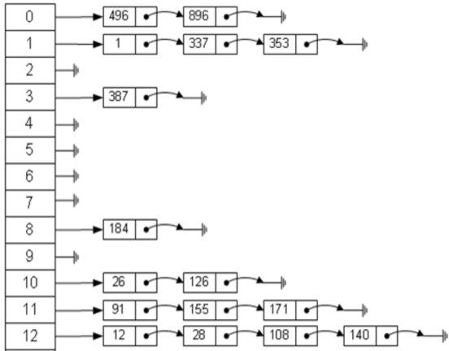
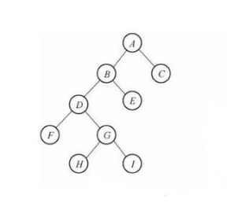
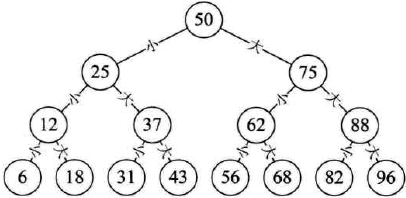
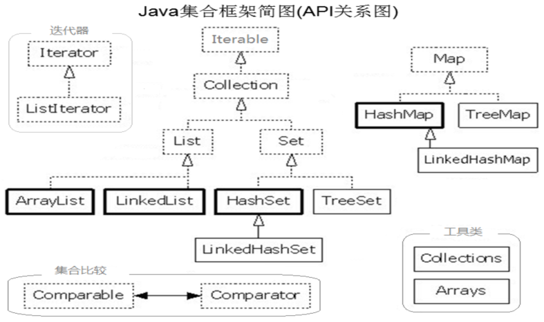

### 一、数据结构

1.研究和解决什么问题？
一堆数据怎么在内存中存储更方便、更高效

2.数据在内存中不一定都是挨着连续存储的

3.例如公司，党派，帮派；每个都有自己的组织模式和运行机构来帮助他们正常发展和运行。

4.常见的数据结构：
线性表(list)   链表(linked list)    栈(stack)    队列(queue)  树(tree)

5.list，线性表  分三种

|名称|介绍|举例|
|---|---|---|
|有序列表 |插入的顺序作为遍历的顺序，位置不变(长度固定)| 数组
|顺序存储 |插入的顺序作为遍历的顺序，允许插入和删除（位置可变）   长度可变   缺点：插入和删除的效率低    优点：查询效率高||
|链式存储(链表) |哪里有空位，就可以往哪里存  优点：插入和删除的效率高  缺点：查询效率很低||

6.栈   先进后出，后进先出，就像弹夹    限制了插入和删除的位置，只能在一端(尾部)进行
例如：
浏览器的“前进”和“后退”
很多软件的“撤销”和“恢复”

7.队列(queue)   先进先出  后进后出     插入是在对尾，删除是在对前      客服电话的排队
例如：大学食堂排队打饭，医院挂号排队等

8.Hash table(散列表，也叫哈希表)是根据关键码值(Key-value)而直接进行访问的数据结构。也就是说，它通过把关键码值映射到表中一个位置来访问记录，以加快查找的速度。（目录+链表，就像字典）

- 特点：目录+链表   插入、删除和查询的效率都很高
- 缺点：没下标
- 

9.树        二叉树      平衡二叉树(红黑树)   特点    插入、删除和查询的效率都很高

### 二、Java集合概述

1.我们要存的数据的个数是不确定         集合

2.数组只能存同一种类型的数据

3.集合可以称之为超级数组

4.打开java.util.ArrayList的源代码，首先映入眼帘的是@author  Josh Bloch，
这位大叔就是玉树凌风，风流倜傥，人称Java之母的Josh Bloch ，Java集合框架就是他一手打造的

5.结构图

[JAVA集合知识点汇总<一> List集合](/Java_Collection01_List)

项目地址:[传送门](https://github.com/AFinalStone/Java_Collection)
